JOIV : Int. J. Inform. Visualization, 6(2) - June 2022 298-305 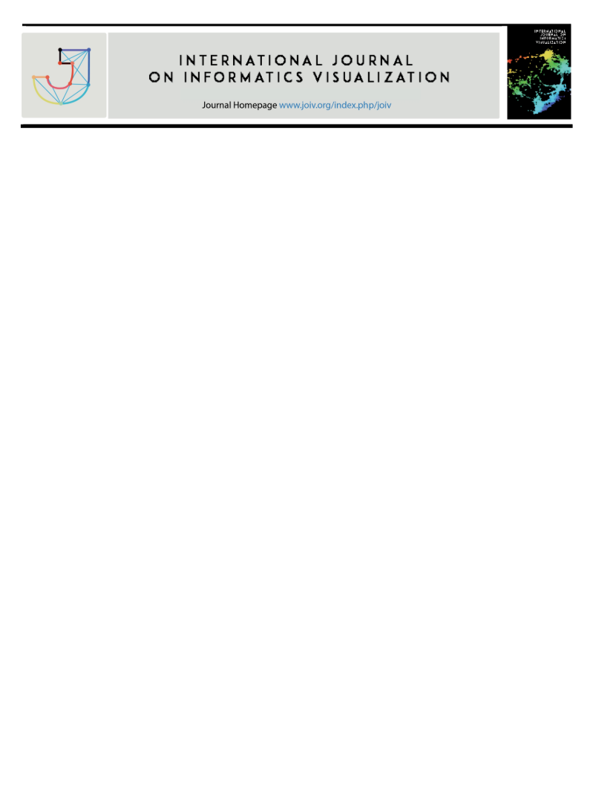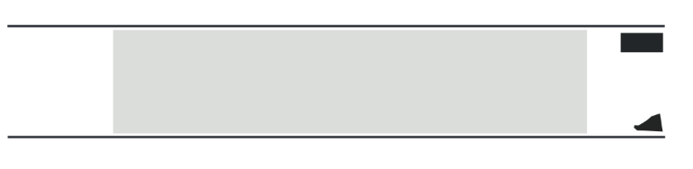

**INTERNATIONAL JOURNAL ON INFORMATICS VISUALIZATION**

**INTERNATIONAL JOURNAL**

**ON INFORMATICS VISUALIZATION**

**journal homepage :  www.joiv.org/index.php/joiv**

Genetic Algorithm for Artificial Neural Networks in Real-Time Strategy Games 

Yudi Widhiyasana a, Maisevli Harika a,\*, Fahmi Faturahman Nul Hakim a, Fitri Diani a,  Kokoy Siti Komariah b, Diena Rauda Ramdania c 

*a Department of Computer and Informatics, Politeknik Negeri Bandung, West Java, Bandung, 40559, Indonesia* 

*b Dept. of IT Convergence and Applications Engineering, Pukyong National University, 45 Yongso-ro, Nam-Gu, Busan, Republic of Korea c Dept. of Informatics, UIN Sunan Gunung Djati, West Java, Bandung, 48513, Indonesia* 

*Corresponding author: \*widhiyasana@polban.ac.id *

***Abstract***— **Controlling each member of the soldiers to carry out battle with Non-Playable Characters (NPC) is one of the secrets to winning Real-Time Strategy games. The game could be more complicated and offer a more engaging experience if every NPC acts like humans rather than machines with patterned behavior. Like people during a war, each army member's command requires rapid reflexes and direction to strike or evade attacks. An intelligent opponent based on ANN as NPC can react quickly to their opponents. The accuracy of ANN could be enhanced by weight modifications using a Genetic Algorithm (GA). The crossover and mutation rates significantly impact GA's performance as an ANN setup. This research aims to find the best crossover and mutation rates in GA as a weight adjustment in ANN. Experiments were conducted using an RTS game simulator using 20 scenarios on a maximum of 4000 iterations. The initial setup of each troop is random, with a seven-unit type available. In this research, the troops won because their men were subjected to fewer attacks than the opposing forces. The GA optimal crossover and mutation rates are determined using troop victories as a baseline. According to the findings, the best crossover rate for GA as an ANN weight adjustment is 0.6, whereas the specific mutation rate is 0.09. The crossover rate of 0.6 has the highest average win value and tends to increase every generation. As for the mutation rate of 0.09, it has the highest average win value. Thus, this preliminary study can develop NPC more humanly.** 

***Keywords***— **Artificial neural networks; game AI; human-like behavior; real-time strategy games.** 

*Manuscript received 25 Feb. 2022; revised 11 Mar. 2022; accepted 20 Apr. 2022. Date of publication 30 Jun. 2022. International Journal on Informatics Visualization is licensed under a Creative Commons Attribution-Share Alike 4.0 International License.* 

298

1. INTRODUCTION

Many  genres  in  video  games  include  action-adventure, adventure, role-playing, strategy, and others [1], [2]. Each genre focuses on its playing style [1]. Like the strategy genre, it prioritizes careful planning from players to achieve victory. In strategy games, there are characters called Non-Playable Characters  (NPC).  NPCs  can  act  as  observers,  allies,  or enemies in the game. NPCs respond interactively to player interactions [1], [3]. 

Today,  video  games  are  becoming  a  popular  subject, ranging from entertainment to improving understanding of learning[2], [4]. Much research has been done involving video games.  One  of  the  popular  genres  related  to  Artificial Intelligence (AI) is the Real-Time Strategies (RTS) genre [5]– [7]. Players of this RTS game need to collect resources, build infrastructure,  train  military  units,  upgrade  technology, declare war, and defeat enemies [8]. So, in general, decision-

making  in  RTS  games  is  categorized  into  two.  Macro- management (MaM) and micromanagement (MiM)[9]. 

Macro  management  is  decision-making  for  long-term planning,  such  as:  building  military  barracks,  conducting technological  research,  training  military  units,  and  others. Micromanagement can plan small units in battle or small units to minimize unit losses and maximize damage to opponents [9],  [10].  Small  units  are  NPCs.  NPCs  with  human-like decision-making habits could improve the gaming experience [11], [12]. Making NPCs with human-like decision-making abilities can use AI [13], [14]. One of them uses the Artificial Neural Network (ANN) method. 

ANN is a mathematical method that tries to simulate the structure and function of biological neural networks in the human brain [15]. The basic form of ANN is an artificial network  with  simple  mathematical  operations.  The  ANN inputs  and  outputs  are  weighted[15].  Weight  set  is  a significant problem in the use of ANN. Algorithms such as 

backpropagation, genetic algorithms, and others are a choice of solutions[16]. 

A  Genetic  Algorithm  is  a  widespread  evolutionary algorithm. The ability to obtain the best generation due to crossover,  mutation,  and  selection  determines  the performance of GA. Some previous studies have used this algorithm  for  several  purposes.  An  example:  academic scheduling [17], sentiment review analysis of fashion online companies [18], microgrid energy management [19], children activities model [20], operational planning of cement mills loading [21], corporal Portal Search Engines [22], the optimal combination of forest fire [23], heart sound segmentation [24], detection  of  urban  areas  [25],  short-term  solar  power forecasting [26], breast cancer [27], mobile robot path [28], Bone  Cancer  Survivability  Prognosis  [29],  Space-Based Telescopes  [30],  et  cetera.  This  study  aims  to  adjust  the weight  on  the  ANN  using  a  genetic  algorithm  (GA)  to determine the best crossover rate and mutation rate values for troops  in  RTS  games.  This  study  could  show  the  best crossover  rate  and  mutation  rate  for  GA  to  weigh  ANN against troop wins in RTS games. 

2. MATERIAL AND METHOD

The stages of research carried out in this study started from identifying  the  problem  and  research  objectives,  then conducting a literature study, collecting data used as input, conducting system design, system testing, analyzing results, and  finally  drawing  conclusions.  This  section  discusses related to research rather than the stages of research. The research steps are more or less the same as research in general. They  started  by  identifying  the  problem  and  research objectives. Then do a literature study, develop a simulator to simulate  an  RTS  game,  test  the  simulator,  conduct experiments, and conclude the investigation. 

1. *Research Analysis* 

The input layer of the ANN is information related to the environment  and  unit  information,  while  the  output  layer controls the unit. This research uses one hidden layer with 18 neurons.  We  utilize  the  sigmoid  function as an activation function to get a result between zero and one. 

Gene is a weighted ANN with 56 chromosomes for one fitness function. The battle between two armies is a fitness function and has seven different units, or each type consists of four teams. The initial formation of the troops is randomly chosen. The battle could last as long as all units can move and start Returning to the initial appearance if all teams are not moving. 

After getting the fitness value of each chromosome at the fitness  function  stage,  a  selection  is  made.  The  selection method used is Tournament selection (TOS). The principle of TOS is first to select several  in all individuals and then find the most significant fitness value. The crossover method in this study uses a one-point crossover. 

2. *Experiment Unit* 

In the RTS game, each unit has four parameters: health, attack damage, fire damage, and delay. Health is the unit's 

health value with a minimum value of one, and damage is the unit attack value that can reduce the health value of the enemy. This study has two categories: damage for melee attacks and fire  or  long-range  attacks  and  delays.  Delays  is  a  unit's movement  to  move  forward  or  attack  the  enemy.  This parameter has a fairness of 10. Fairness data on each unit can be seen in Table I. 

TABLE I 

FAIRNESS DETAILS FOR EACH UNIT

|**Type** |**Unit** |**Attack** |**Fire** |**Delay** |**Health** |**Total** ||||||
| - | - | - | - | - | - | - | :- | :- | :- | :- | :- |
|
1 2 3 4 5 6 

7 
||Swordman Archer Spearman Axeman Heavy Very Heavy Cavalry |
2 2 3 3 3 4 

2 
||
1 4 3 1 1 1 

1 
||
5 3 3 4 3 1 

6 
||
2 1 1 2 3 4 

1 
||
10 10 10 10 

10 10 

10 
|

The experimental unit is a simulation of the RTS game that GA has set as the ANN weight setting for the troop control unit.  The  simulation  accepts  input  in  crossover  rate  and mutation rate values, and the output is the ANN model after weight  adjustment.  This  model  could  be  the  input  to determine the best crossover and battle mutation rates. The battle output is the winning percentage for each crossover rate and mutation rate used in the learning stage. 

3. *Experimental Scenario* 

The experiment in this study has two scenarios, learning and  measuring  the  win  rate  of  learning—experiments  on learning change the crossover rate and mutation rate values. This study's maximum number of generations is 4000 [31]. ANN model with each weight after learning is the result. The crossover rate uses 0.6 to 0.9 based on the research results of Soon et al. [32]. 

The second scenario measures the win rate from the first scenario. It aims to find out the win rate for each weight. Both designs have conducted a battle between two armies with unit 

weights according to the results of the learning scenario. The flow of the simulation game in this experiment is divided into several processes. 

1) *GA Process Flow*: GA process flow is a process flow 

that describes the process of GA after it is implemented with ANN, ground manager, and units. Fig. 1 is an illustration of the GA process flow. In Fig. 1, the GA process flow. Initial weight is the initial weight initiation of the GA process. The ground manager sets respawn units, stores fitness values, and calculates the number of wins. Selection weight is the stage of choosing the weight to be the parent, selection repeatedly until getting a parent with half the population.* 

2) *ANN  Process  Flow  is  the  ANN  process  flow  after implementing GA.* The flow is shown in Fig. 2. The first step is  to  set  the  weight  to  assign  weights  from  the  comma- separated values (CSV) file to the ANN model. Weight is a single-line  CSV  file.  Furthermore,  ANN  running  receives input. Save output saves ANN output on a variable that can be used for further processing.* 

299

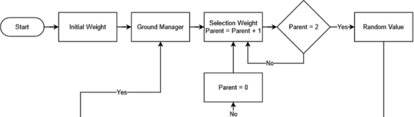

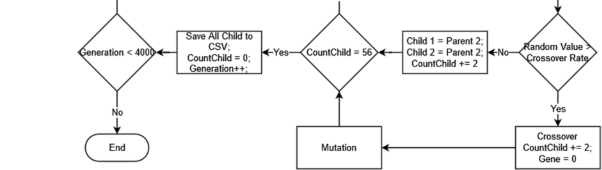

Fig. 1  GA Process flow in the experiment 

300

Fig. 2  ANN process flow in the experiment 

ANN input in the form of neurons connected to the hidden layer. The two input neurons are information about the unit's environment and the unit itself. The large-scale environment of  the  unit  is  depicted  as  a  four-region  overall  battle environment,  as  shown  in  Fig.  3a,  while  the  small-scale environment of the unit is depicted in eight grids, as shown in Fig. 3b. 

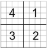 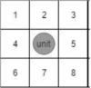

(a)  (b) 

Fig. 3  Large-scale environment (a) and small-scale environment (b) 

Each  region  in  a  large-scale  environment  could  record information in the form of: 

- The average distance of opponents in each region, 
- The average friend distance in each region, 
- Number of opponents in each region, and 
- The number of friends in each region. 

The small-scale environment could record information in the form of whether or not friends or foes are present on each grid, including unit information itself, such as: 

- Current health, 
- Delay value, 
- Attack value, 
- Fire value, and 
- Previous outputs. 

All input neurons can be seen in Table II. 

TABLE II 

INPUT NEURON

|**Id input**  |**Information**  |
| - | - |
|
1  2  3  4  5  6  7  8  9  10  11  12  13  14  15  16  17  18  19  20  21  22  23  24  25  26  27  28  29  30  31  32  33  34  

35  36  37  
|
*Region one Enemy Average Distance*  *Region two Enemy Average Distance*  *Region three Enemy Average Distance*  *Region four Enemy Average Distance*  *Region one Friend Average Distance*  *Region two Friend Average Distance*  *Region three Friend Average Distance*  *Region four Friend Average Distance*  *Region one Number of Enemy*  

*Region two Number of Enemy*  

*Region three Number of Enemy*  *Region four Number of Enemy*  

*Region one Number of Friend*  

*Region two Number of Friend*  

*Region three Number of Friend*  *Region four Number of Friend*  *Self-Current Health*  

*Self-Delay*  

*Self-Attack*  

*Self-Fire*  

*Prev (Attack/Fire/Move)*  

*Enemy at Grid one*  

*Enemy at Grid two* 

*Enemy at Grid three* 

*Enemy at Grid four* 

*Enemy at Grid five* 

*Enemy at Grid six* 

*Enemy at Grid seven* 

*Enemy at Grid eight* 

*Friend at Grid one* 

*Friend at Grid two* 

*Friend at Grid three* 

*Friend at Grid four* 

*Friend at Grid five* 

*Friend at Grid six* 

*Friend at Grid seven* 

*Friend at Grid eight* 
|

The results of the output neurons must be able to contain the values of output 1 (attack) and output 3 (fire). Output 2 has  the  value  of  the  movement  with  the  illustration  of Fig. 4. 

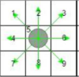

Fig. 4  Movement representation on output neurons 

The condition of the unit that could attack, fire, or move can be seen in Table III. 

TABLE III 

REPRESENTATION OUTPUT NEURON

|**Output 1 (*Fire*)**  |**Output 3 (*Attack*)**  |**Information** |
| - | - | - |
|Value 0 to 0.5  Value 0 to 0.5  Value 0.5 to 1  Value 0.5 to 1  |Value 0 to 0.5  Value 0.5 to 1  Value 0 to 0.5  Value 0.5 to 1  |
Units move Unit *attack*  Unit *fire*  

Unit does not act 
|

A unit could attack if output 1 is between 0.5 and one and output three is zero to 0.5. Likewise, the team could fire if output 1 is between zero and 0.5 and output three is between 0.5 and one. Meanwhile, the team could move if outputs 1 and 3 are between zero and 0.5. The unit may not act if output one and output 3 are between 0.5 and one. A unit could attack, fire, or move to the north or grid number two in Table IV if output 2 is between 0.11 to 0.22, as in Table IX, row two. So, a unit could fire to the east or grid number six in Table III if output 

1 is between zero and 0.5, output 3 is between 0.5 to one, and output 2 is between 0.55 to 0.66. 

TABLE IV 

OUTPUT VALUE AS A GRID NUMBER

|**Output 2 (Coordinate)** |**Grid Number** |
| - | - |
|
Value 0 to 0,11  Value 0.11 to 0.22  Value 0.22 to 0.33  Value 0.33 to 0.44  Value 0.44 to 0.55  

Value 0.55 to 0.66  Value 0.66 to 0.77  
|
1 2 3 

4 5 6 7 
|

3) *Ground Manager Process Flow*: The ground manager 

is the function of controlling the entire existing unit, and f is the ground manager process flow. 

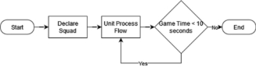

Fig. 5  Ground manager process flow in experiments 

The declared squad stage is the process of respawning units on  the  ground.  Unit  positions  are  determined  randomly according to each team and followed by unit process flow. 

4) *Unit Process Flow*: Unit process flow helps manage units. Fig. 6 shows the process flow. Read environment process to see environmental conditions for ANN input. The Do output stage  is  a  unit  process  running  ANN  output  and  finally calculating the fitness value.

301

Fig. 6 Unit process flow in the experiment 

4. *Battle Analysis* 

The battle between two teams lasts for 10 seconds, and each unit uses its attributes. For example, unit type 1 could run ANN every 0.2 seconds. Unit type 2 could run ANN every 0.4 seconds, and so on. The unit ability is shown in Table V according to the points of each unit in Table I.  

TABLE V 

ABILITY THE UNIT AND ANN PROCESSING TIME

**Damage  Damage  Delay  Health **

**Attack  Fire** 

1   *Swordman*   2  20  1  10  5  0,2  2  100 2   *Archer*   2  20  4  40  3  0,4  1  50 3   *Spearman*   3  30  3  30  3  0,4  1  50 4   *Axe man*   3  30  1  10  4  0,3  2  100 5   *Heavy*   3  30  1  10  3  0,4  3  150 6   *Very*  4  40  1  10  1  0,6  4  200 

*Heavy*  

7   *Cavalry*   2  20  1  10  6  0,1  1  50 

Issues  could  have  a  real  value  using  the  equation, multiplied by ten for each case for the damage parameter and 50 for each point for the health parameter. Meanwhile, the delay  parameter  uses  the  formula  (5− )/10.  The  unit could not perform ANN or die until health is zero. Unit health can be reduced if the unit receives an attack from the enemy unit. 

The battle is a fitness function from GA to get a fitness score, where the higher the fitness score, the better the unit. The fitness function is recorded for every unit's movement, as shown in Table VI. Each fitness score could be totaled after the battle takes place. The lowest possible value for each unit is -2050. The lowest value could occur if unit type 7 attacks on space until the end of the battle and is hit by attacks from enemy units until health is zero. In comparison, the highest possible value is 2000. The highest value could occur if unit type 7 attacks the enemy unit during the battle. 

TABLE VI 

REWARDS AND PUNISHMENT FOR EACH UNIT

**Fitness Function**   **Fitness Score**   **Reward Code**  Move Success   0,1/move  RC1 Damage Taken   -1/damage  RC2 

|**Fitness Function**  |**Fitness Score**  |**Reward Code**  |
| - | - | - |
|
Damage  Given Enemy  

Attack  

Fire  

Crash with Wall  Damage  Given Friend  

Attack  

Fire  

Crash  with  Friend or Enemy  

Damage to Nothing or Self  

Nothing  

Self  

Attack  and  Fire (both)  
|
1/damage 

1/damage 1/damage -0,1/crash -1/damage 

-1/damage -1/damage -0,1/crash 

-1/damage 

-1/damage -1/damage -1 
|
RC3 

RC3.1 RC3.2 RC4 RC5 

RC5.1 RC5.2 RC6 

RC7 

RC7.1 RC7.2 RC8 
|

5. *GA Analysis as ANN Weight Setting* 

The ANN structure consists of the input layer, hidden layer, and  output layer.  The  input layer  consists  of  37 neurons, where each neuron is represented in Table II. The hidden layer consists of 18 neurons, and the output layer consists of 3 neurons.  The  number  of  weights  on  the  ANN  is  720, consisting of 666 weights connecting id input 1 to input id 37 to hidden neurons 1 18, and 54 weights connecting hidden neurons 1 to hidden neurons 18 to output 1 to output 3. Each weight has an id starting from 1 connecting id input 1 to hidden neuron 1 to 720 connecting hidden neuron 18 to output 3. Visualization explanation Fig. 7. 

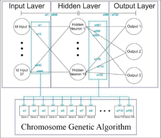

Fig. 7  ANN structure and its mapping to GA 

The GA chromosome is a set of 720 ANN weights. The GA chromosome consists of 720 genes which represent 720 ANN weights. Gene 1 on the GA chromosome is 1 in ANN, gene 2 is w2 on ANN, and so on until gene 720 is 720 in ANN. The number  of  chromosomes  used  in  this  study  is  56 chromosomes. Chromosome 1 could use ANN belonging to id unit 1, chromosome 2 use ANN belonging to id unit 2, and so on until chromosome 56 for id unit 56 representation can be seen in Fig. 8. 

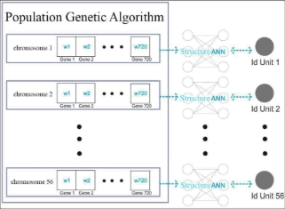

Fig. 8  Representation of chromosomes to units 

Each unit could be divided into two teams, as shown in Fig. 9, team A and team B. Unit id 1 to unit id 28 is team A, and unit id 29 to unit id 56 is team B. 

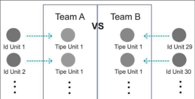

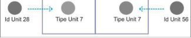

Fig. 9  Representation of unit id to unit type 

3. RESULT AND DISCUSSION

Before  the  experiment  is  carried  out,  developing  a simulator using the C# programming language with the Unity Game Engine library is necessary. The simulator has been tested with test cases, as shown in Table VII. 

TABLE VII 

FUNCTIONAL REQUIREMENTS OF THE SIMULATOR

|**Req.ID** |**Requirements** |**Status** |
| - | - | - |
|
REQ.1 REQ.2 REQ.3 

REQ.4 REQ.5 
|
The simulator can accept input crossover rate, mutation rate, and total generation during the learning stage 

The simulator records the weight value of each population and generation into a .csv file inside a folder chosen at the learning stage 

The simulator displays information on the most significant fitness value in that generation and the total of the generations that have been carried out in the learning stage 

The simulator is capable of receiving input folder locations of each battle scenario and the total battles of each scenario at the measurement stage 

Simulator capable of measuring win rate, displaying and saving to .csv file 
|
Success Success 

Success Success Success 
|

The simulator display during the learning scenario can be seen in Fig. 10 and the win rate in Fig. 11. 

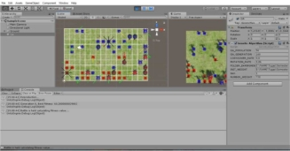

Fig. 10  Experiment simulator view when doing learning scenario 

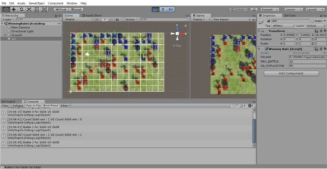

Fig.  11   The  simulator  display  when  carrying  out  the  number  of  wins scenarios 

After getting the number of wins in each scenario. The team's win  percentage  is  added  to  each  scenario  code,  and  the winning generation is divided into the total battle. Table VIII shows the experimental results measuring the win rate for each scenario code. 

TABLE VIII 

WIN RATE EXPERIMENT RESULTS

**Scenario  Generation **

**Code  1000  2000  3000  4000 S606**   45%  65%  42%  72% **S607**   35%  63%  48%  39% **S608**   47%  55%  41%  63% **S609**   47%  45%  54%  57% **S610**   47%  49%  46%  46% **S706**   63%  29%  42%  41% **S707**   53%  39%  45%  43% **S708**   54%  35%  47%  47% **S709**   45%  69%  58%  53% **S710**   39%  57%  64%  51% **S806**   42%  45%  41%  44% **S807**   45%  51%  39%  43% **S808**   56%  42%  61%  50% **S809**   63%  59%  59%  47% **S810**   48%  43%  44%  47% **S906**   42%  27%  42%  37% **S907**   37%  40%  54%  42% **S908**   43%  60%  39%  36% **S909**   57%  46%  48%  33% **S910   ** 38%   34%   42%   57% 

6. *Experiment with Each Crossover rate* 

The average wins for the crossover rates generation are 1000,  2000,  3000,  and  4000  (Table  IX).  The  initial 

assumption of a crossover rate is 0.8, and 0.9 cannot give a better average win than 0.6 and 0.7. A crossover rate of 0.6 showed the best performance in Generation 2000 and 4000, while 0.7 in Generation 1000 and 3000. A crossover rate of 

8. showed the best performance in Generation 1000, but the value was slightly different from 0.7. The best performance is 
8. on the Generation 3000 Force, but the overall percentage is still under 47.5%. 

TABLE IX 

THE AVERAGE WINS FOR THE CROSSOVER RATES

**Crossover  Generation  **

**Rate  1000  2000  3000  4000  Average **

6. 44.4%  55.3%  46.1%  55.4%  50.3% 
6. 50.8%  45.9%  51.2%  46.8%  48.7% 
6. 50.6%  48.1%  48.9%  46.4%  48.5% 
6. 43.5%  41.2%  45.1%  41.1%  42.7% 
7. *Experiment for Each Mutation Rate* 

Table X shows the average win rate for each mutation rate in the generation 1000, 2000, 3000, and 4000. In Table X, the mutation  rate  of  0.09  shows  the  best  performance  in  the generation 1000, 2000, and 3000, while the generation 4000 mutation rate of 0.1 is better. Mutation rates of 0.06 and 0.07 gave the best performance of 48%, which is the average value of the overall mutation rate. The mutation rate of 0.1 shows an increase in each generation of generations, from 1000, worth 43%, to the generation of 4000, worth 50%. The 0.09 mutation rate shows its best performance in each generation, except for 4000 (shown in Table X, line four with a value of 47,7%). However, it is still, on average, the overall mutation rate. 

TABLE X 

THE AVERAGE WINS FOR THE MUTATION RATES

**Mutation  Generation  **

**Rate  1000  2000  3000  4000  Average **

6. ` `48.0%  41.4%  41.8%  48.2%  44.9% 
6. 42.6%  48.2%  46.4%  41.7%  44.7% 
6. 49.9%  48.0%  47.2%  49.2%  48.6% 
6. 53.1%  54.7%  54.7%  47.7%  52.5% 

0\.1   43.2%  45.8%  48.9%  50.3%  47.0% 

8. *Experiment for Each Crossover Rate and Mutation Rate* 

Table XI shows the win rate for each scenario code carried out. The highest victory rate for generation 1000 is scenario code S706 or crossover rate 0.7 and mutation 0.06 with a value of 62.9 %, which is 0.3 % more than scenario code S809 with a value of 62.6 %. The "generation 2000" scenario code S709 has the highest win rate with a win percentage of 69.5 %. Next, with 63.9 %, "generation 3000" scenario code S710 has the highest victory rate, and "generation 4000" scenario code S606 has the best win rate with 71.6 %. Overall, with a value of 56.9%, the S809 scenario code delivers the best average for each generation, a difference of 0.5 % from the second place, namely the S709 scenario. 

TABLE XI 

THE AVERAGE WINS FOR THE CROSSOVER RATES AND MUTATION RATE

**Scenario  Generation  **

**Code  1000  2000  3000  4000  Average S606 ![ref1]![ref1]**  45.0%  65.3%  41.8%  71.6%  55.9% 

**S607**   35.3%  62.6%  47.9%  38.9%  46.2% **S608**   47.4%  55.0%  41.3%  63.4%  51.8% **S609**   47.4%  45.0%  53.9%  56.8%  50.8% 

**Scenario  Generation  **

**Code  1000  2000  3000  4000  Average S610 ![ref2]![ref3]![ref2]![ref3]**  47.1%  48.7%  45.5%  46.1%  46.8% 

**S706**   62.9%  28.9%  42.4%  40.8%  43.8% **S707**   52.6%  39.2%  44.7%  42.6%  44.8% **S708**   54.2%  34.7%  47.1%  46.8%  45.7% **S709**   45.3%  69.5%  57.6%  53.4%  56.4% **S710**   39.2%  57.1%  63.9%  50.5%  52.7% **S806**   41.8%  44.7%  40.5%  43.7%  42.7% **S807**   45.0%  51.3%  39.2%  43.2%  44.7% **S808**   55.5%  42.1%  61.3%  50.3%  52.3% **S809**   62.6%  58.7%  58.9%  47.4%  56.9% **S810**   48.2%  43.4%  44.5%  47.4%  45.9% **S906**   42.1%  26.8%  42.4%  36.8%  37.0% **S907**   37.4%  39.7%  53.9%  42.1%  43.3% **S908**   42.6%  60.0%  38.9%  36.3%  44.5% **S909**   57.1%  45.5%  48.4%  33.2%  46.1% **S910**   ![ref4] 38.4%  ![ref5] 33.9%  ![ref4] 41.6%  ![ref5] 57.1%   42.8% 

4. CONCLUSION

Micromanagement in RTS games significantly affects the victory of the game. Reasonable reaction control on NPCs could make the RTS experience more challenging. Using GA as ANN weight adjustment proves that NPCs can learn well. The correct crossover rate for this study is 0.6 because it has the highest average win value and tends to increase every generation. Meanwhile, the exact mutation rate in this study is 0.09 because it has the highest average win value. After the correct crossover rate and mutation rate, this research can be continued to other cases or add more input to ANN, such as dangerousness  and  attack  range  parameter  for  long-range attack type units. 

REFERENCES

1. L. F. Bicalho, B. Feijó, and A. Baffa, "A culture model for non-player characters' behaviors in role-playing games," in *Brazilian Symposium on Games and Digital Entertainment, SBGAMES*, 2020, vol. 2020- Novem, pp. 9–18, doi: 10.1109/SBGames51465.2020.00013. 
1. M. Mostafa and O. S. Faragallah, "Development of Serious Games for Teaching Information Security Courses," *IEEE Access*, vol. 7, pp. 169293–169305, 2019, doi: 10.1109/ACCESS.2019.2955639. 
1. M. Černý, T. Plch, M. Marko, J. Gemrot, P. Ondráček, and C. Brom, "Using  behavior  objects to  manage  complexity in  virtual  worlds," *IEEE Trans. Comput. Intell. AI Games*, vol. 9, no. 2, pp. 166–180, 2017, doi: 10.1109/TCIAIG.2016.2528499. 
1. D. Rauda Ramdania, M. Harika, S. Rahmadika, and G. Giftia Azmiana, "The  Use  of  Relations  and  Functions  Games  Based  on  Balanced Design  in  Mathematics  Subjects  to  Improve  Student  Learning Outcomes,"  *J.  Phys.  Conf.  Ser.*,  vol.  1175,  no.  1,  2019,  doi: 10.1088/1742-6596/1175/1/012069. 
1. D. Novak, D. Verber, J. Dugonik, and I. Fister, "A comparison of evolutionary and tree-based approaches for game feature validation in real-time strategy games with a novel metric," *Mathematics*, vol. 8, no. 5, 2020, doi: 10.3390/MATH8050688. 
1. L. Wu and A. Markham, "Evolutionary machine learning for RTS game starcraft," in *31st AAAI Conference on Artificial Intelligence, AAAI 2017*, 2017, pp. 5007–5008. 
1. Y.  Zhen,  Z.  Wanpeng,  and  L.  Hongfu,  "Artificial  intelligence techniques  on  real-time  strategy  games,"  in  *ACM  International* 

   *Conference  Proceeding  Series*,  2018,  pp.  11–21,  doi: 10.1145/3297156.3297188. 

8. D.  Churchill  *et  al.*,  "StarCraft  Bots  and  Competitions,"  *Encycl. Comput. Graph. Games*,  pp. 1–18, 2016, doi: 10.1007/978-3-319- 08234-9\_18-1. 
8. F. F. Duarte, N. Lau, A. Pereira, and L. P. Reis, "A survey of planning and  learning  in  games,"  *Appl.  Sci.*,  vol.  10,  no.  13,  2020,  doi: 10.3390/app10134529. 
8. F.  Dai,  J.  Gong,  J.  Huang,  and  J.  Hao,  "Macromanagement  and Strategy Classification in Real-Time Strategy Games," *Proc. - 2nd* 

   *China Symp. Cogn. Comput. Hybrid Intell. CCHI 2019*, pp. 263–267, 2019, doi: 10.1109/CCHI.2019.8901957. 

11. M. J. Kim, K. J. Kim, S. Kim, and A. K. Dey, "Performance Evaluation Gaps in a Real-Time Strategy Game between Human and Artificial Intelligence Players," *IEEE Access*, vol. 6, pp. 13575–13586, 2018, doi: 10.1109/ACCESS.2018.2800016. 
11. C. A. Cruz and J. A. R. Uresti, "HRLB^2: A reinforcement learning based framework for believable bots," *Appl. Sci.*, vol. 8, no. 12, 2018, doi: 10.3390/app8122453. 
11. V. M. Petrovic, "Artificial Intelligence and Virtual Worlds-Toward Human-Level AI Agents," *IEEE Access*, vol. 6, pp. 39976–39988, 2018, doi: 10.1109/ACCESS.2018.2855970. 
11. M. Kopel and T. Hajas, "Implementing AI for Non-player Characters in 3D Video Games," in *Lecture Notes in Computer Science (including subseries Lecture Notes in Artificial Intelligence and Lecture Notes in Bioinformatics)*, vol. 10751 LNAI, 2018, pp. 610–619. 
11. O. I.  Abiodun,  A. Jantan,  A. E. Omolara,  K.  V. Dada, N.  A.  E. Mohamed, and H. Arshad, "State-of-the-art in artificial neural network applications:  A  survey,"  *Heliyon*,  vol.  4,  no.  11,  2018,  doi: 10.1016/j.heliyon.2018.e00938. 
11. M. A. J. Idrissi, H. Ramchoun, Y. Ghanou, and M. Ettaouil, "Genetic algorithm for neural network architecture optimization," *Proc. 3rd IEEE  Int.  Conf.  Logist.  Oper.  Manag.  GOL  2016*,  2016,  doi: 10.1109/GOL.2016.7731699. 
11. T. Suratno, N. Rarasati, and Z. Gusmanely, "Optimization of Genetic Algorithm for Implementation Designing and Modeling in Academic Scheduling," *Eksakta Berk. Ilm. Bid. MIPA (E-ISSN 2549-7464)*, vol. 20, no. 1, pp. 17–24, 2019. 
11. S. Ernawati, E. R. Yulia, Frieyadie, and Samudi, "Implementation of the  Naïve  Bayes  Algorithm  with  Feature  Selection  using  Genetic Algorithm  for  Sentiment  Review  Analysis  of  Fashion  Online Companies," in *2018 6th International Conference on Cyber and IT Service  Management,  CITSM  2018*,  2019,  pp.  1–5,  doi: 10.1109/CITSM.2018.8674286. 
11. S.  Leonori,  M.  Paschero,  F.  M.  F.  Mascioli,  and  A.  Rizzi, "Optimization strategies for Microgrid energy management systems by Genetic Algorithms," *Appl. Soft Comput.*, vol. 86, p. 105903, 2020. 
11. A.  García-Dominguez  *et  al.*,  "Feature  Selection  Using  Genetic Algorithms for the Generation of a Recognition and Classification of Children Activities Model Using Environmental Sound," *Mob. Inf. Syst.*, vol. 2020, 2020, doi: 10.1155/2020/8617430. 
11. V. I. Svetlichnaya, E. O. Savkova, O. O. Shumaieva, O. V Chengar, and  V.  I.  Shevchenko,  "Using  genetic  algorithms  for  operational planning  of  cement  mills  loading,"  in  *IOP  Conference  Series: Materials Science and Engineering*, 2021, vol. 1047, no. 1, p. 12134. 
11. Y. Qiu, D. Wang, and H. Yan, "Research on Application of Genetic Algorithms in Corporal Portal Search Engines," in *2021 IEEE 5th Advanced  Information  Technology,  Electronic  and  Automation Control Conference (IAEAC)*, 2021, vol. 5, pp. 1310–1314. 
11. H.  Hong,  P.  Tsangaratos,  I.  Ilia,  J.  Liu,  A.-X.  Zhu,  and  C.  Xu, "Applying genetic algorithms to set the optimal combination of forest fire-related variables and model forest fire susceptibility based on data mining models. The case of Dayu County, China," *Sci. Total Environ.*, vol. 630, pp. 1044–1056, 2018. 
11. M. A. Alonso-Arévalo, A. Cruz-Gutiérrez, R. F. Ibarra-Hernández, E. García-Canseco,  and  R.  Conte-Galván,  “Robust  heart  sound segmentation  based  on  spectral  change  detection  and  genetic algorithms,” *Biomed. Signal Process. Control*, vol. 63, p. 102208, 2021, doi: 10.1016/j.bspc.2020.102208. 
11. D. Mokadem, A. Amine, Z. Elberrichi, and D. Helbert, "Detection of urban  areas  using  genetic  algorithms  and  kohonen  maps  on multispectral images," *Int. J. Organ. Collect. Intell.*, vol. 8, no. 1, pp. 46–62, 2018. 
11. M. Ratshilengo, C. Sigauke, and A. Bere, "Short-Term Solar Power Forecasting Using Genetic Algorithms: An Application Using South African Data," *Appl. Sci.*, vol. 11, no. 9, p. 4214, 2021. 
11. F. Ahmad, N. A. M. Isa, M. H. M. Noor, and Z. Hussain, "Intelligent breast cancer diagnosis using hybrid GA-ANN," in *Proceedings - 5th International  Conference  on  Computational  Intelligence, Communication Systems, and Networks, CICSyN 2013*, 2013, pp. 9– 12, doi: 10.1109/CICSYN.2013.67. 
11. W. Rahmaniar and A. E. Rakhmania, "Mobile Robot Path Planning in a Trajectory with Multiple Obstacles Using Genetic Algorithms," *J. Robot. Control*, vol. 3, no. 1, pp. 1–7, 2022. 
11. S. Muthaiyah and V. A. Singh, "Bone Cancer Survivability Prognosis with  KNN  and  Genetic  Algorithms,"  in  *Concepts  and  Real-Time Applications of Deep Learning*, Springer, 2021, pp. 123–134. 

304

30. H. Chit Siu and V. Pankratius, "Genetic Algorithms for Starshade  [32]  G. K. Soon, T. T. Guan, C. K. On, R. Alfred, and P. Anthony, "A Retargeting in Space-Based Telescopes," *arXiv e-prints*,  p. arXiv- comparison  on  the  performance  of  crossover  techniques  in  video 1907, 2019.  game,"  in  *Proceedings  -  2013  IEEE  International  Conference  on* 
30. K. Shao, Y. Zhu, and D. Zhao, "StarCraft Micromanagement with  *Control System, Computing and Engineering, ICCSCE 2013*, 2013, pp. Reinforcement Learning and Curriculum Transfer Learning," *IEEE*  493–498, doi: 10.1109/ICCSCE.2013.6720015. 

    *Trans. Emerg. Top. Comput. Intell.*, vol. 3, no. 1, pp. 73–84, 2019, doi: 

    10\.1109/TETCI.2018.2823329. 
305

[ref1]: Aspose.Words.22e78504-6516-49f7-874a-7c098ca3eea0.053.png
[ref2]: Aspose.Words.22e78504-6516-49f7-874a-7c098ca3eea0.060.png
[ref3]: Aspose.Words.22e78504-6516-49f7-874a-7c098ca3eea0.061.png
[ref4]: Aspose.Words.22e78504-6516-49f7-874a-7c098ca3eea0.066.png
[ref5]: Aspose.Words.22e78504-6516-49f7-874a-7c098ca3eea0.067.png
